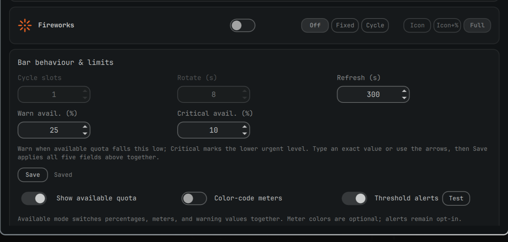

# Agent Usage Plus


<p align="center">
  
  
</p>

Native Omarchy bar widget for AI coding usage, limits, balances, pace, costs
and history. It reads Omarchy and local collector records, so it works with
subscriptions and API accounts without storing credentials.

Forked from the MIT-licensed `omarchy.agents` widget bundled with Omarchy and
expanded into a standalone plugin.

## Install

```bash
omarchy plugin add https://github.com/viganogabriele/agent-usage-plus.git --enable
```

## Update

```bash
omarchy plugin update io.github.viganogabriele.agent-usage-plus
```

## Remove

```bash
omarchy plugin remove io.github.viganogabriele.agent-usage-plus
```

## Providers

Claude Code, Codex, Fireworks, OpenRouter, DeepSeek, Gemini, Cursor, Kimi,
OpenCode Go, Devin, Google Antigravity, xAI/Grok and Z.AI/GLM.

Claude Code and Codex use Omarchy's built-in records. Other providers use the
optional collectors:

```bash
./collectors/install.sh
~/.local/share/agent-usage-plus-collectors/bin/agent-usage-plus-collectors update
```

Requires Omarchy with Quickshell plugin support. The plugin has no other
runtime dependency; optional collector setup is documented in
[collectors/README.md](collectors/README.md).

The widget follows Omarchy's live theme. An optional traffic-light palette uses
green, amber, and red for Healthy, Warn, and Critical meters. Notifications are
off by default; when enabled, each provider alerts once at Warn and once at
Critical. The widget can optionally express quota as available instead of used;
percentages, meters, warning controls, and alerts switch together while keeping
the same underlying trigger points.



## Multi-device sync

Local providers (Claude Code, Codex) only see the transcripts on the machine
they run on, so a fresh machine reads as all-zero for today and history until
it has done some work of its own. To combine usage across every machine you
use, turn on **Multi-device sync** in the panel's Settings and point it at a
folder — each machine then writes its own small JSON snapshot into that
folder and reads every other machine's snapshot from it, summing today's
tokens and merging the daily history.

The panel never syncs the folder itself — it only reads and writes inside
one that's already kept identical across your machines by some other tool.
[Syncthing](https://syncthing.net) is a common, free, no-cloud-required
choice; a synced Nextcloud/Dropbox folder or a network mount (NFS/SMB/sshfs)
works just as well. Point every machine's sync folder setting at the same
path once that folder itself is syncing, and each machine picks up the
others' numbers on its next refresh.

Details: [collector setup](collectors/README.md),
[record contract](docs/collector-contract.md), [manual QA](docs/manual-qa.md),
[troubleshooting](docs/troubleshooting.md), [contributing](CONTRIBUTING.md).

MIT licensed; see [LICENSE](LICENSE).
